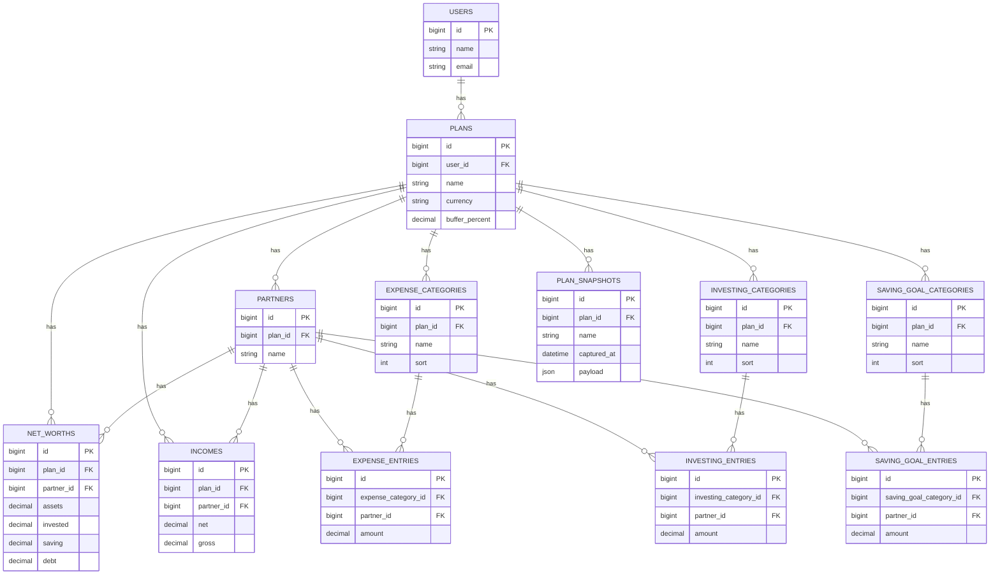

# Conscious Spending Plan

A Laravel app that implements Ramit Sethi's Conscious Spending Plan as a shared, side-by-side money table for one or more partners. It captures net worth, income, expenses, investing, and saving goals, then calculates totals and the remaining guilt-free spending.

## What the app does

- Builds a single plan per user with default categories and partner labels.
- Lets you rename partners, add/remove partners, and add/remove categories.
- Captures net worth (assets, invested, saving, debt) per partner.
- Captures net and gross annual income per partner.
- Tracks expenses, investing, and saving goals per partner.
- Applies an adjustable expense buffer percentage (default 15%).
- Computes totals, net-worth rollups, and guilt-free spending.
- Shows category totals as a share of net income.
- Saves everything to the database and reloads it on visit.

## Core sections and defaults

- Net Worth: Assets + Invested + Saving - Debt.
- Income: Net and gross annual income per partner.
- Expenses (default categories):
  - Rent or Mortgage
  - Utilities
  - Insurance
  - Car Payment
  - Groceries
  - Clothes
  - Phone
  - Subscriptions
  - Debt
- Investing (default categories):
  - Post-tax Retirement Saving
  - ETF
  - Other
- Saving Goals (default categories):
  - Vacation
  - Gifts
  - Long Term Emergency Fund
- Guilt-Free Spending: net income minus expenses, investing, and saving goals.

## Calculations and behavior

- Net worth per partner = assets + invested + saving - debt.
- Net income total = sum of partner net income (gross total is tracked separately).
- Expenses total = sum of expense categories + buffer percent.
- Investing total and saving total are summed per partner and overall.
- Guilt-free spending = net income - expenses - investing - saving goals.
- Percent-of-income figures are based on total net income.
- Category labels and partner names are editable; empty names fall back to defaults.
- Currency is stored on the plan (default `USD`); UI formatting currently uses `USD`.

## Snapshots and trends

- Create snapshots of the current plan state.
- Snapshot data is stored as a JSON payload with a captured timestamp.
- Snapshot summary page shows latest totals and deltas vs previous snapshots.
- A time-series chart tracks assets, expenses, investing, and saving over time.
- Date range filters narrow the snapshot history and chart.

## Exports

- Export the plan as CSV.
- Export the plan as PDF (via DomPDF) with the current buffer percent and currency.

## Accounts and auth

- Fortify-backed registration, login, password reset, and password confirmation.
- Profile page to update name/email and password.
- All plan and snapshot routes require authentication.

## Data model (high level)

- `Plan`: name, currency, buffer percent, belongs to user.
- `Partner`: partner label(s) for the plan.
- `NetWorth`: assets, invested, saving, debt per partner.
- `Income`: net and gross income per partner.
- `ExpenseCategory` + `ExpenseEntry`: expense labels + amounts per partner.
- `InvestingCategory` + `InvestingEntry`: investing labels + amounts per partner.
- `SavingGoalCategory` + `SavingGoalEntry`: saving goal labels + amounts per partner.
- `PlanSnapshot`: captured payload of the full plan.

## Database diagram

## Tech stack

- Laravel 12 + Fortify authentication
- Alpine.js + Tailwind CSS v4 (Vite)
- Lightweight Charts for snapshot trends
- DomPDF for PDF exports
- Blade UI Kit Heroicons for icons

## Local development

- `composer run setup` - install deps, create `.env`, migrate, build assets.
- `composer run dev` - run PHP server, queue worker, logs, and Vite.
- `npm run dev` - run Vite in watch mode.
- `npm run build` - build production assets.
- `composer run test` - run the Laravel test suite.
